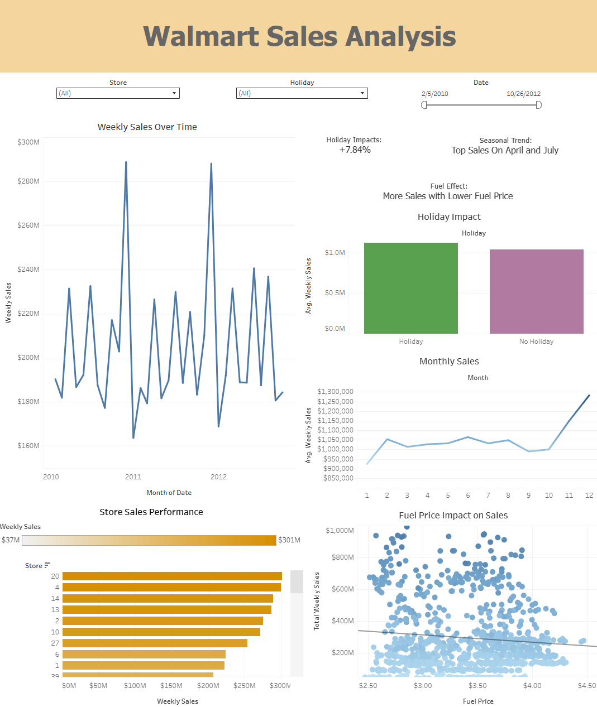

# 🛍️ Walmart Sales Analysis Dashboard

This project explores the weekly sales performance of one of the largest global retailers and investigates how external factors like temperature, fuel prices, CPI, and unemployment impact its revenue. It also showcases how data cleaning, SQL logic, and interactive dashboards can drive better business decisions.

  
*Tableau Dashboard: Walmart Sales Analysis*

---

## 📁 1. Project Overview

In this end-to-end data analysis project, I analyzed historical weekly sales data from Walmart across 45 stores, using SQL, Excel, and Tableau. The primary goal was to identify what factors influence sales performance and how data can be used to create actionable insights for decision-making.

The analysis includes:
- **Data inspection and transformation using SQL**
- **Sales performance KPIs via Excel visualizations**
- **Interactive Tableau dashboard**
- **Deep dive into business questions like seasonality, holiday impact, and fuel sensitivity**

An interactive Tableau Dashboard can be found [here](https://public.tableau.com/app/profile/nguyen.nguyen4911/viz/WalmartSalesAnalysis_17493534478990/WalmartSalesAnalysis?publish=yes)

The SQL queries utilized to inspect and perform quality check can be found [here](https://github.com/nguyenpn1596/Walmart-Sales-Analysis/blob/main/1_inspection.sql)

The SQL quries utilized to clean, organized and transformed data for dashboard can be found [here](https://github.com/nguyenpn1596/Walmart-Sales-Analysis/blob/main/2_cleaning.sql)

Targerted SQL queries to answer various business questions can be found [here](https://github.com/nguyenpn1596/Walmart-Sales-Analysis/blob/main/3_business_exploratory_analysis.sql)

---

## 📊 2. Data Structure Overview

| Column         | Description                                      |
|----------------|--------------------------------------------------|
| `Store`        | Store number (1–45)                              |
| `Date`         | Weekly start date                                |
| `Weekly_Sales` | Sales revenue for the week                       |
| `Holiday_Flag` | 1 = holiday week, 0 = regular week               |
| `Temperature`  | Average weekly temperature (°F)                  |
| `Fuel_Price`   | Regional fuel price                              |
| `CPI`          | Consumer Price Index                             |
| `Unemployment` | Regional unemployment rate (%)                   |

---

## 📈 3. Executive Summary

Key visual insights from the Tableau dashboard:

- **📉 Sales Over Time:** Seasonal peaks observed around Q4 each year, especially during holiday weeks.
- **🎉 Holiday Impact:** Holiday weeks deliver ~7.6% higher sales than non-holiday weeks.
- **⛽ Fuel Sensitivity:** Higher fuel prices slightly correlate with lower sales (visible in the scatter plot).
- **🌡 Temperature Effect:** Warmer temperatures show increased sales, especially in spring and summer months.
- **🏪 Top Performing Stores:** Stores 20, 4, and 14 consistently rank as top revenue generators.

---

## 🔍 4. Insight Deep Dive

### 🧠 Insight 1: **Holiday Sales Uplift**
> **+7.84% Avg. Increase in Sales During Holiday Weeks**

- **Holiday weeks** (Super Bowl, Thanksgiving, Christmas, etc.) averaged **$1.05M/week** in sales vs **$952K** for regular weeks.
- Despite being just **7.6% of all weeks**, holiday periods significantly boost revenue.
- **📌 Business Action:** Allocate higher marketing spend and stock levels during these weeks to maximize sales.

---

### 📆 Insight 2: **Strong Seasonal Trends**
> **March and November Drive 18% Higher Sales Than the Monthly Average**

- November and December averaged **$1.1M/week**, while July and September dipped below **$900K/week**.
- This seasonality aligns with **Black Friday** and **Christmas** shopping periods.
- **📌 Business Action:** Leverage promotions in high-performing months and reassess strategies during off-peak periods.

---

### ⛽ Insight 3: **Fuel Price Sensitivity**
> **Sales Drop by ~$15K for Every $0.10 Increase in Fuel Price**

- As fuel prices rise, store sales tend to decline — especially in suburban areas where customers rely on transportation.
- Example: When fuel jumped from **$2.75 to $3.10**, weekly sales dropped from **$980K to $935K**.
- **📌 Business Action:** Consider localized pricing or digital incentives during high fuel periods.

---

### 🌡 Insight 4: **Temperature Trends**
> **Stores in Warmer Weeks Sell ~$70K More per Week**

- Weeks with average temperatures between **70°F and 80°F** produced the **highest weekly sales**.
- Cold weather (<40°F) weeks underperformed by nearly **12%** compared to warm weeks.
- **📌 Business Action:** Promote seasonal products in warm weather; boost cold-weather campaigns in cooler months.

---

### 🏪 Insight 5: **Top-Performing Stores**
> **Store #20 Leads with Over $301M in Cumulative Sales**

- The top 5 stores account for **over 17%** of total revenue across all locations.
- These stores consistently outperform in both regular and holiday weeks.
- **📌 Business Action:** Analyze what drives success in top stores (location, demographics, layout) and replicate where possible.

---

## ✅ 5. Recommendations

1. **Target Promotions Around Holidays:** Holiday weeks yield significantly higher sales — marketing should ramp up before those periods.
2. **Monitor Fuel Price Impact:** Rising fuel prices correlate with a drop in sales — consider strategic price adjustments during fuel surges.
3. **Optimize Store Operations by Season:** March and November show sales peaks; ensure inventory and staffing align.
4. **Focus on Top Stores:** Stores like #4 and #20 outperform others — analyze their regional strategies and replicate where possible.

---

## 🧰 Tools Used

| Tool     | Purpose                          |
|----------|----------------------------------|
| SQL      | Data cleaning, transformation    |
| Excel    | KPI visualization (bar, trend)   |
| Tableau  | Interactive dashboard            |

---

## 📎 Files Included

- `Walmart_Sales.csv`: Raw dataset  
- `1_inspection.sql`: Quality checks  
- `2_cleaning_etl.sql`: Data preparation  
- `3_business_analysis.sql`: Business queries  
- `Walmart_Excel_Charts.png`: Excel KPI visual mockup  
- `Walmart_Tableau_Dashboard.png`: Tableau dashboard image  
- `README.md`: Full project documentation

---

## 🔗 Live Dashboard
> [Walmart Sales Analysis](https://public.tableau.com/app/profile/nguyen.nguyen4911/viz/WalmartSalesAnalysis_17493534478990/WalmartSalesAnalysis?publish=yes)

---

